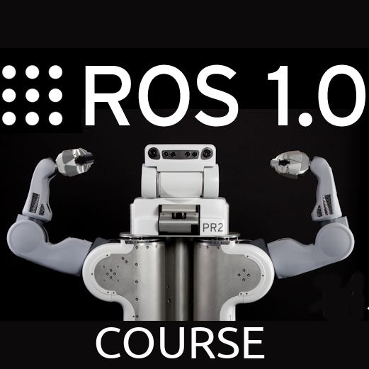

# 1 Изучение Topic в ROS

Пошел текст перевода...

## Заголовок H1

Еще какой то текст

### Заголовок H2

И еще какой то текст

#### Заголовок H3

```python
код на pyhon
if a == b:
```

```cpp
код на C++
if a == b 
{
}
```

Таблица

| колонка 1 | колонка 2 |
| :--- | :--- |
| ячейка 1 | ячейка 2 |
| ячейка 3 | ячейка 4 |



Формула:

$$
a = b^2
$$

Пример оформления ссылки [google](https://google.com) или [яндекс](https://ya.ru)

```text
$ rostopic echo /rosout
результат вывода
ыва
ываыва
ыаыа
ывпаыа
```

